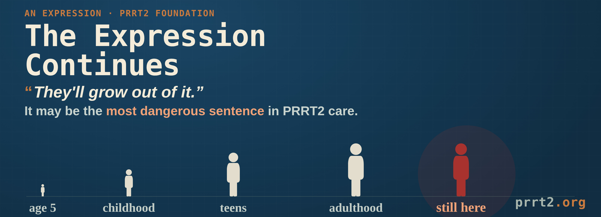

# The Expression Continues

### How the field's own reference text shifted from "paroxysmal movement disorders" to "related disorder," and why that shift matters more than most parents are ever told

_An Expression · July 28, 2026_

<figure><figcaption></figcaption></figure>


**🧭 Foundation Note**

_The PRRT2 Foundation's own synthesis and lived experience, offered alongside the established science — not as established medical fact._


Parents hear this in the same appointment as a PRRT2 diagnosis, almost every time, and it's meant kindly: _"Don't worry — they'll grow out of it."_

It isn't exactly false. A lot of infant seizures do remit. Most childhood movement episodes do fade with age. But the sentence implies something the research doesn't actually back up: that once the episodes stop, the gene is done with the story. We don't think that's true. The literature is starting to agree.

## The reference text changed its own name

You don't have to take a patient advocacy group's word for this. The clinical reference chapter that geneticists and neurologists consult to diagnose and counsel PRRT2 families changed what it calls this condition.

In January 2018, the GeneReviews chapter was published as **PRRT2-Associated Paroxysmal Movement Disorders**. In its July 2024 revision — the same NCBI record, NBK475803 — the same chapter is titled **PRRT2-Related Disorder**.

Two things disappeared from that title. _Paroxysmal_, which means episodic: it comes, it goes, there is nothing in between. And _movement disorders_, which names one phenotype out of several. What replaced them is broader and makes no promise about episodes: a related disorder, full stop.

Reference chapters are not renamed casually. That title is what a clinician sees first, and what a genetic counsellor cites in a family meeting. Changing it is a statement about scope.

## A gene re-described, one decade at a time

The same shift shows up across the published record, and it is worth reading in order.

In **2014**, an early paper on PRRT2 in the differential-diagnosis literature framed the question categorically: here is what this childhood condition looks like, and here is what it isn't. It set out the classic clinical criteria for paroxysmal kinesigenic dyskinesia, including a normal neurological examination between attacks.

In **2015**, the field's landmark PRRT2 review argued against treating PRRT2's conditions as separate diseases that happen to share a gene, describing them instead as one evolving spectrum. But that spectrum was still framed largely around childhood and adolescent presentations — infantile epilepsy, then PKD in childhood and adolescence.

By **2018, and again in the July 2024 revision**, the GeneReviews chapter had widened further. Dr. Darius Ebrahimi-Fakhari, Director of the Movement Disorders Program at Boston Children's Hospital and a Harvard Medical School faculty member, was first author of the 2018 chapter and is senior author of the 2024 revision. The chapter now describes core phenotypes spanning epilepsy, movement disorder, and migraine, with onset ranging from infancy through adolescence into adulthood — and describes those phenotypes as appearing in combination, either concurrently or sequentially, as individuals age.

_Concurrently or sequentially._ Not "and then it ends." Not "and then they outgrow it." The gene can keep moving through new forms across an entire life.

A **2025** international multicenter study then documented what happens when PRRT2 epilepsy doesn't follow the script. Across 40 children, three with heterozygous PRRT2 variants diverged from the expected course: one evolved from self-limited infantile epilepsy into infantile epileptic spasms, one developed spike-wave activation in sleep, and one developed focal epilepsy in adolescence — years after a family may have been told the worst was behind them.

Three of forty is not most, and we want to be straight about that. That study's central finding is the reassuring one: most heterozygous cases did resolve, typically before 36 months. But its title is where the field's attention has moved — _From Self-Limited Infantile Epilepsy to Atypical Epilepsy Phenotypes._ The atypical cases used to be footnotes. They are now in the title.

This isn't a patient advocacy organization arguing against the research. This is the research revising itself in public, one update at a time.

## Why this matters more than it sounds like it should

The reference text doesn't only say these phenotypes can follow one another. It says they can appear concurrently or sequentially — at the same time, layered together, or one after another with real gaps in between. Those are two different lived experiences, and the field has mostly only told one of them well.

The sequential story is the one most people hear. A child has infantile seizures. The seizures stop. Years pass. A teenager develops migraines, or an adult develops a movement disorder, and nobody connects it back to a diagnosis from childhood. "Grow out of it" breaks down here because the gene didn't graduate. It went quiet and came back in a new form, sometimes years later, sometimes decades.

The concurrent story gets told far less, and it deserves equal weight. For some people, PRRT2 doesn't take turns. Dystonia and muscle rigidity can be present at the same time, layered into daily life rather than arriving as separate, clean episodes with nothing in between. Persistent voice symptoms may belong in this picture too, though we want to be careful: the PRRT2–dysphonia connection is **not established** in the published literature, and we treat it as an open question rather than a finding — see [Dysphonia](https://www.prrt2.org/exploring-the-wider-spectrum/dysphonia) for how we handle that distinction.

We should be exact about how far the reference text goes here, because the distinction matters. GeneReviews describes those three core phenotypes as _episodic_ ones. It establishes that PRRT2 can produce new phenotypes across an entire lifespan, into adulthood — which is the point of this piece. It does not describe continuous, non-episodic symptoms. That pattern is our own observation from our own community, and we label it as such rather than borrowing authority the citation doesn't give us.

Classic paroxysmal kinesigenic dyskinesia, the most studied PRRT2 phenotype, is formally defined in part by a normal neurological exam between attacks: clean baseline, discrete episodes, full recovery in between. That picture is real and well documented. It was never meant to describe the whole gene. Generalized dystonia and chronic muscle rigidity sit in a far less studied corner of the PRRT2 spectrum, and the thin literature on that pattern isn't evidence that it's rare. It may just be evidence that nobody has been collecting it carefully.

This is where the danger lives, and it cuts two ways. Parents who are told their child will simply grow out of PRRT2 understandably let their guard down. Why wouldn't they? They were told the hard part was over. They stop watching for new symptoms, and they don't think to mention an old diagnosis years later when something unrelated-looking shows up.

But there's a second, quieter harm, and it belongs to people whose symptoms never actually went away. If you were told as a child that this would resolve, and instead you've lived with constant muscle rigidity, or a voice that spasms on certain sounds, "grow out of it" doesn't just fail to predict your future — it contradicts your present. That gap between what you were promised and what you're actually living with can make a real, ongoing, gene-driven experience feel like something you're imagining, exaggerating, or somehow failing to outgrow on schedule.

We see this same blind spot in our own [count of how many people actually carry this gene](how-many-of-us.md): adults whose PRRT2 never disappeared, whether it changed shape over the years or simply never left, and who are missing from the official record because nobody looked for the connection.

## The mechanism doesn't predict an ending, either

This isn't just a clinical observation. It tracks with what PRRT2 actually does. The gene isn't a switch that fires once in infancy and then goes quiet. It's a presynaptic protein, active throughout the central nervous system, regulating neurotransmitter release and synaptic stability for as long as the brain it sits in is alive. There was never a strong mechanistic reason to expect its influence to switch off after childhood. The "growing out of it" pattern clinicians observe describes one particular expression, usually the PKD episodes, receding with age, most likely as a developing brain's excitability settles down. That was never evidence the underlying vulnerability had gone anywhere.

## A question the field has raised but never answered

There's a further layer here, and it needs to be said carefully, because it sits right at the edge of what's actually been proven.

Within our own community, a pattern shows up that the published literature doesn't fully explain. For some, symptoms that appeared very early, in early childhood, while the body is still actively wiring the circuits involved, seem to settle into something fixed and continuous: present in some form every day from then on, even as severity rises and falls. For others, symptoms that emerge later, often in adolescence or adulthood, behave the way PKD is classically described: discrete, separate episodes that come and go, with real stretches of nothing in between.

We want to be precise about what is and isn't established here. No published PRRT2 study has directly tested whether the age a symptom first appears predicts whether it becomes permanent or stays episodic. That question hasn't been answered. But it has been raised, and there are real reasons to take it seriously.

PRRT2 has two distinct jobs that happen at different points in life. Earlier in development, the gene is involved in neuronal migration, spinogenesis, and the formation and maintenance of synapses: the actual wiring of circuits. Later, once those circuits exist, its job shifts to regulating neurotransmitter release moment to moment, keeping already-formed circuits stable. A disruption during the wiring phase isn't the same kind of problem as a disruption during the stability-maintenance phase, even if both come from the identical mutation. One is closer to a construction error. The other is closer to a flickering light switch in a house that was otherwise built correctly.

A 2021 review of PRRT2-associated disorders, by Landolfi, Barone and Erro at the University of Salerno, raised exactly this possibility in print. It noted that the difference in age at onset between PRRT2's epilepsy and movement-disorder phenotypes may reflect differing expression of PRRT2 across cortical and subcortical regions during brain development — and pointed out that existing data on where and when PRRT2 is active in the brain comes largely from adult tissue, meaning the field has not really been positioned to detect a critical developmental window even if one exists.

A 2021 mouse study built specifically to test age-dependence found that kind of window-dependent effect. The same genetic deletion produced different severity and character of impairment depending on the developmental age at which it was measured, and the authors identified three distinct age-dependent phenotypic windows across early life, a young-adult age, and later adulthood.

We should be fair about what that mouse paper does and doesn't say. Its own framing describes PKD in humans as typically improving or resolving by middle age. It is evidence that _timing_ shapes how this gene expresses itself. It is not evidence that nothing resolves. Those are different claims, and only the first one is ours to make.

If something like this holds in humans — if the developmental moment a circuit gets disrupted determines whether the resulting symptom locks in permanently or stays paroxysmal — it would be one of the more clinically important things left to learn about this gene. It would mean _when_ in a life PRRT2 first causes trouble may matter as much as _that_ it causes trouble at all.


**🧭 Foundation Note**

_The PRRT2 Foundation's own synthesis and lived experience, offered alongside the established science — not as established medical fact._

This is precisely the kind of question a single case, or even a handful of case reports, cannot answer — but a registry can. To find out whether age of onset predicts permanence, researchers need hundreds of documented cases with reliable onset ages and symptom histories tracked over years, not isolated reports scattered across decades of literature. It is one of the clearest, most concrete reasons we are pursuing a formal patient registry partnership: not as paperwork, but as the only realistic path to answering a question this important.

It is also part of why we push so directly for genetic testing whenever PRRT2 is even a plausible explanation for someone's symptoms — in infants, in children, and in adults whose presentations don't fit the textbook picture. Every untested person with a plausible PRRT2 presentation is a data point this question will never get to use. The undercount we describe in [How Many of Us Are There?](how-many-of-us.md) isn't just a number problem. It's a research problem. We can't answer questions about how this gene behaves across a lifetime if most of the people carrying it are never identified in the first place.


## What we think this means for how PRRT2 should be talked about

We're not asking clinicians to frighten families at diagnosis, and nothing in the literature we've cited asks for that either. Reassurance, when it's accurate, matters enormously to a frightened parent in an exam room. What we're asking is for the reassurance to match what the field itself now understands: the episodes of early childhood may well resolve. The gene does not graduate.

The honest version of the sentence is closer to _"these particular episodes will very likely improve, and we should still watch for the gene to show up again, in a different form, at any point in their life."_ That sentence is longer. It's less comforting in the moment. It also keeps a seventeen-year-old's unexplained migraine connected to an answer that already exists in their chart, and leaves room to ask the right question when atypical struggles show up later in life: a dystonic episode that persists, or resurfaces, well into adulthood. The right question, asked early enough, replaces a new diagnostic odyssey with a chart that already has the answer in it.

And we want to be fair here, because this isn't about any one clinician or researcher falling short. A rare gene that can present as a seizure in one decade, a movement disorder in another, and a migraine or a voice change in a third is, by its nature, built to slip past standard clinical training. No physician can be expected to carry every rare, evolving presentation of every gene into a fifteen-minute visit. That isn't a failure of individual care. It's a structural gap in how rare disease knowledge moves from research into the exam room — and the researchers writing these updates are the ones closing it. Our role is to help that knowledge travel faster than textbooks usually allow.

## What the Foundation is doing about it

* **Naming the pattern plainly**, here and across the site, instead of letting "benign" and "grow out of it" stand unchallenged.
* **Documenting adult and recurrent presentations** through [Exploring the Wider Spectrum](https://www.prrt2.org/exploring-the-wider-spectrum), so the next person whose symptoms return in a new form has somewhere to recognize themselves.
* **Building registry partnerships** designed specifically to capture lifelong, evolving expression — not just a single childhood snapshot — so the natural history of this gene gets documented properly for the first time.
* **Following the researchers writing this shift into the literature**, because the field is already moving in this direction, and patients and families deserve to hear about it sooner than they currently do.

The expression doesn't end when the episodes stop. The field is already saying so, one revision at a time, in its own words — including in the title of its own reference chapter. We intend to say it louder and sooner, until "grow out of it" stops being the last thing a family hears.

## Sources

Every source below is listed with a DOI, PMID, or NCBI Bookshelf ID so any claim on this page can be checked directly.

* Ebrahimi-Fakhari D, Moufawad El Achkar C, Klein C. _PRRT2-Associated Paroxysmal Movement Disorders._ **GeneReviews®**, University of Washington, Seattle. Initial posting 11 January 2018. NCBI Bookshelf: NBK475803. _(The 2018 chapter title.)_
* Yang K, Quiroz V, Ebrahimi-Fakhari D. _PRRT2-Related Disorder._ **GeneReviews®**, University of Washington, Seattle. Initial posting 11 January 2018; revised 4 July 2024. NCBI Bookshelf: NBK475803. _(The retitled 2024 revision of the same chapter.)_
* Ebrahimi-Fakhari D, Saffari A, Westenberger A, Klein C. _The evolving spectrum of PRRT2-associated paroxysmal diseases._ **Brain** 138(12):3476–3495, December 2015. doi:10.1093/brain/awv317.
* Ebrahimi-Fakhari D, Kang KS, Kotzaeridou U, Kohlhase J, Klein C, Assmann BE. _Child Neurology: PRRT2-associated movement disorders and differential diagnoses._ **Neurology** 83(18):1680–1683, 28 October 2014. doi:10.1212/WNL.0000000000000936. PMID: 25349275. _(Source for the classic PKD criteria, including the normal interictal examination.)_
* Komar M, Sidhu J, Joseph J, Kumar A, Callen DJA, Mesterman R, Ramachandrannair R, Jones KC, Meaney BF, Singh S, McRae L, Chau V, Sharma S, Donner EJ, Aaron R, Danda S, Thomas M, Saini L, Costain G, Yoganathan S, Jain P, Whitney R. _PRRT2-Related Epilepsy: From Self-Limited Infantile Epilepsy to Atypical Epilepsy Phenotypes._ **Neurology: Genetics** 11(3):e200267, 20 May 2025. doi:10.1212/NXG.0000000000200267. PMC12094785.
* Landolfi A, Barone P, Erro R. _The Spectrum of PRRT2-Associated Disorders: Update on Clinical Features and Pathophysiology._ **Frontiers in Neurology** 12:629747, 4 March 2021. doi:10.3389/fneur.2021.629747. PMID: 33746883.
* Fay AJ, McMahon T, Im C, Bair-Marshall C, Niesner KJ, Li H, Nelson A, Voglmaier SM, Fu Y-H, Ptáček LJ. _Age-dependent neurological phenotypes in a mouse model of PRRT2-related diseases._ **Neurogenetics**, 2021. doi:10.1007/s10048-021-00645-6. PMC8241743.

For the complete reference set, see [Official Resources](https://www.prrt2.org/resources/official-resources).

## Continue reading

* [How Many of Us Are There?](how-many-of-us.md) — the undercount this same blind spot helps create
* [Current Literature](https://www.prrt2.org/research/current-literature) — the field's own shift away from "invariably benign"
* [Beyond the Blunt Instruments](beyond-blunt-instruments.md) — why a lifelong condition still has no targeted treatment

***

_If your PRRT2 story didn't end when you were a child, if it came back later, in a different form, after someone told you it was over, your story is part of how this gets corrected. Share it through_ [_Links & Support_](https://www.prrt2.org/resources/links-and-support)_, or add it to_ [_Patient Stories_](https://www.prrt2.org/living-with-prrt2/patient-stories)_._
